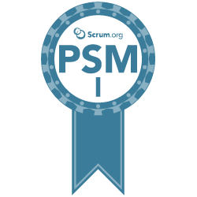

### Hi Folks! 👋
I am Shasank Dave, A software engineer(GoLang|Ab>Initio) with agile mindset, #MLOnGoogleCloudPlatformEnthusiast. 
I feel Data Science field is just like me #CuriousChild!

# Sofware Engineer | DataScience Explorer | Curious Child :)

- 🔭 I’m currently working on: Kaggle Notebooks in my freetime on Weekends.
- 🌱 I’m currently learning: Tensorflow
- 👯 I’m looking to collaborate on: Kaggle Competitions(To Get Started)
- 🤔 I’m looking for help with : Writing Datascience blog posts & Mentoring on Data science projects
- 💬 Ask me about: "Ask me anything about data!"
- 📫 How to reach me: shasankdave@gmail.com
- 😄 Pronouns: He/Him
- ⚡ Fun fact: StayCurious & Experimenting in life!

# DataScience Learning via MOOCs so far :
[IBM Data Science Professional](https://www.coursera.org/account/accomplishments/specialization/certificate/SBHQ52YBWSWE)  
[DeepLearning.AI Tensorflow Developer](https://www.coursera.org/account/accomplishments/specialization/certificate/YXDQ8EGP95TC)  
[DataCamp: Data Scientist with python track](https://www.datacamp.com/statement-of-accomplishment/track/ccb4ffeba9febfa6dce4d09f0a302af2695b801e)  
[Google Data Analytics Professional](https://coursera.org/share/4501cc94cd0e8a49b20edfba0a28bde2)  

# Agile/Scrum :
 [Professional Scrum Master] (https://www.scrum.org/certificates/377755) 

## KeepLearning :

